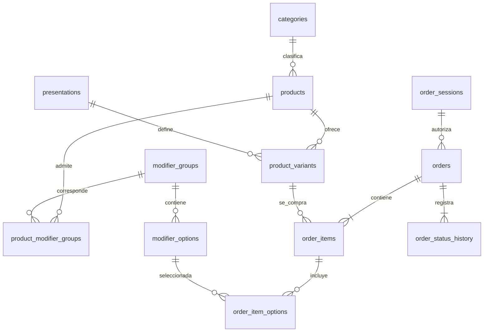
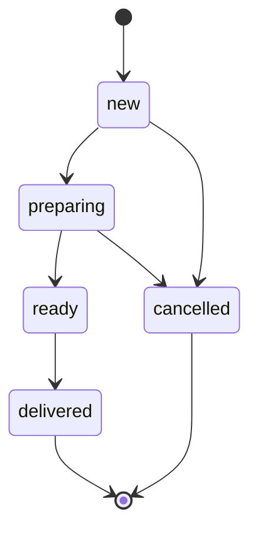

# Organización de la base de datos de Buster’s

Estado: implementado el 11 de septiembre de 2026 en PostgreSQL. Esquema de la aplicación: `prisma/schema.prisma` en el backend; restricciones, índices parciales y permisos: `prisma/sql/005_normalized_catalog_orders.sql`.

## Qué representa cada entidad

| Tabla | Responsabilidad | Ejemplo |
|---|---|---|
| `categories` | Clasificar productos; su ID permanece aunque cambie el nombre | Bebida |
| `products` | Identidad, nombre, descripción, imagen, categoría y disponibilidad del producto | Café latte |
| `presentations` | Definir una presentación reutilizable y su volumen, si se conoce | M, 350 ml |
| `product_variants` | Vincular un producto con una presentación y su precio y disponibilidad propios | Café latte M: $50.00 |
| `modifier_groups` | Definir una elección y cuántas opciones se permiten | Tipo de moka: exactamente una |
| `modifier_options` | Opciones y su precio adicional | Moka blanco: $0.00 |
| `product_modifier_groups` | Indicar qué elecciones corresponden a cada producto | Tipo de moka asociado a la bebida caliente y a la fría |
| `order_sessions` | Autorizar una compra anónima mediante el hash de un token temporal | Sesión sin nombre ni correo |
| `orders` | Cabecera, folio, estado, moneda, total y clave para evitar duplicados | Pedido B-123 |
| `order_items` | Partidas y valores vigentes al comprar | Dos cafés latte M a $50.00 |
| `order_item_options` | Opciones elegidas y su precio al comprar | Preparación o sabor seleccionado |
| `order_status_history` | Registrar cada transición y la cuenta del equipo que la realizó | Nuevo → Preparando |

Las cuentas y sesiones del personal siguen en `cafe_access`. Los clientes de la app no reciben cuentas de empleado ni credenciales de la base.

## Justificación de la organización

El catálogo separa atributos que dependen de entidades distintas: la descripción depende del producto; el volumen, de la presentación; el precio, de la combinación producto–presentación. No hay columnas `precio_m`, `precio_g` o `precio_grande`, ni se repite un producto por cada tamaño. Las relaciones de muchos a muchos se representan mediante tablas intermedias.

Esto aplica los principios de normalización que se buscan al diseñar hasta tercera forma normal. Las excepciones del historial son deliberadas: el nombre comprado, el precio, los subtotales, el total y el estado actual se conservan para representar una operación ya realizada. No deben recalcularse usando el catálogo vigente. La API escribe esos valores en una sola transacción.

`products` ya no almacena `price` ni el nombre de la categoría. Para mantener compatible el panel, la API todavía devuelve `price` calculado desde sus variantes y `category` tomado de la relación. No son columnas duplicadas en la base. Los precios JSON se devuelven como cadenas decimales; los importes de pedidos se calculan en centavos enteros y se guardan como `numeric`.

## Reglas de integridad

- UUID como claves primarias; claves foráneas para impedir referencias inexistentes.
- Una combinación activa producto–presentación no puede repetirse. Tampoco puede repetirse un nombre activo dentro de la misma categoría, ignorando mayúsculas y espacios exteriores.
- M corresponde a 350 ml, G a 470 ml y +G a 590 ml. La API completa esos volúmenes y rechaza otros valores para esas etiquetas. Sencillo, doble y cortado no reciben un volumen inventado.
- El precio de cada variante y complemento es no negativo; la API admite como máximo dos decimales.
- Cantidad: 1 a 3 por partida; máximo de 3 productos distintos y 3 unidades totales por producto, sumando tamaños y opciones (hasta 9 partidas). Cada grupo controla sus selecciones mínimas y máximas. La API rechaza opciones ajenas, repetidas o no disponibles.
- El servidor verifica la disponibilidad del producto y de la variante al comprar. Un catálogo cargado anteriormente no garantiza que todavía se pueda pedir todo.
- Archivar un producto o quitar una variante conserva sus registros. Las claves foráneas impiden eliminar físicamente variantes y opciones que figuran en pedidos.
- El editor conserva el ID de una variante cuando cambia su etiqueta. Quitar una variante la archiva; agregar otra crea un ID nuevo.
- Las tablas nuevas tienen RLS activado y acceso directo revocado a `PUBLIC`, `anon` y `authenticated`. Solo la API usa la conexión privilegiada.

## Pedidos y concurrencia

La app envía identificadores, cantidades y opciones; nunca establece precios ni totales. La API bloquea los registros de catálogo durante la lectura de la compra, valida las elecciones y guarda cabecera, partidas, complementos e historial dentro de la misma transacción. Un fallo revierte el pedido completo.

La combinación de sesión de compra y `Idempotency-Key` es única. Un reintento con la misma clave y contenido devuelve el pedido existente; una clave reutilizada con otro contenido produce 409. Así, una conexión interrumpida no obliga a crear un pedido duplicado.

Transiciones permitidas:

El empleado envía también el estado que vio (`from_status`). Si otro empleado ya lo cambió, la API responde 409 y exige actualizar la vista. Los estados terminales no se borran desde el tablero. El tablero presenta todos los activos y una ventana de los últimos 50 recibidos; el historial completo sigue disponible mediante la API paginada.

## Privacidad y alcance

No se solicitan nombres, matrículas, teléfonos ni correos de clientes. Los pedidos tampoco admiten campos de texto libre para anotar datos personales. La consulta individual exige el token de la sesión que creó el pedido: conocer el folio o UUID no basta. La sesión de compra dura siete días; las sesiones del equipo mantienen su duración de ocho horas.

Las cuentas del equipo usan alias ficticios. La contraseña se guarda con scrypt y las sesiones guardan solo hashes de tokens. Los campos libres del catálogo siguen siendo responsabilidad del administrador: deben describir productos, sin datos personales.

El flujo implementado corresponde a recibir, preparar y entregar pedidos. No registra pagos, reembolsos, inventario de ingredientes ni reservas de existencias. La vista Ventas sigue identificada como demostración; no debe presentarse como contabilidad real.

## Evidencia para la evaluación

Las pruebas crean registros temporales y verifican precios por tamaño, conservación de IDs, permisos de ambos roles, opciones obligatorias, exactitud de importes, reintentos concurrentes, aislamiento entre clientes, cambios de estado y conservación del historial después de editar o archivar productos.

Se preservaron los 69 productos y las 139 variantes originales. Hay 67 productos activos: el duplicado de latte vainilla sigue archivado y «Hazlo latte» pasó a ser un complemento. Los tamaños y los precios confirmados por el usuario se conservaron.

El respaldo de la migración está en `cafe_access.catalog_backups`, clave `normalized-catalog-orders-v1`. Contiene las tablas anteriores del catálogo; el código previo está en `catalog-maintenance/backend-before-normalization`. Los importadores anteriores a esta migración son históricos y no deben ejecutarse sobre el nuevo esquema. Una restauración posterior a recibir pedidos requiere una migración inversa que preserve ese historial.
